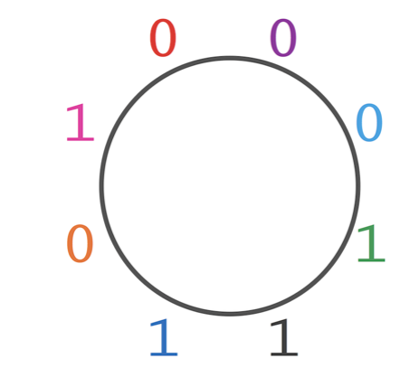

Reference: ([Chapter 3 How do we assemble genomes?](https://www.bioinformaticsalgorithms.org/bioinformatics-chapter-3))

# 3.2 The String Reconstruction Problem

Given a string Text, its k-mer composition Compositionk(Text) is the collection of all k-mer substrings of Text (including repeated k-mers). For example,

Composition3(TATGGGGTGC) = {ATG, GGG, GGG, GGT, GTG, TAT, TGC, TGG}.

### Coding Challenges 3.2.1: Generate the k-mer composition of a string.

&nbsp;&nbsp;&nbsp;&nbsp;__Input__: An integer k and a string Text.

&nbsp;&nbsp;&nbsp;&nbsp;__Output__: Compositionk(Text), where the k-mers are arranged in lexicographic order.

[k-mer generator](k-mer_generator.py)

However, reconstruct string from k-mers is complicated, especially there are repeats in the genome

# 3.3 String Reconstruction as a Walk in the Overlap Graph

### Code Challenge 3.3.1: Solve the String Spelled by a Genome Path Problem.
The answer is different, need to review (not yet finished)

[path_to_genome](/stringReconstitute/pathToGenome.py)

# 3.4 Another Graph for String Reconstruction
## Gluing nodes and de Bruijn graphs

3-mer as node -> Assign 3-mer to edges: see below example

__1. 3-mer into edges, and prefix of 3-mer as node__

<figure>
    
    <figcaption>Figure 3.4.1: 3-mer as edge instead of node.</figcaption>
</figure>

<figure>
    
    <figcaption>Figure 3.4.2: 3-mer with prefix (first 2 mer, k-1 mer) as node.</figcaption>
</figure>

__2. Gluing identical nodes__

<figure>
    
    <figcaption>Figure 3.4.3: Gluing identical node (AT) into one node.</figcaption>
</figure>

<figure>
    
    <figcaption>Figure 3.4.4: Gluing identical node (TG) into one node.</figcaption>
</figure>

<figure>
    
    <figcaption>Figure 3.4.5: Gluing identical node (GG) into one node.</figcaption>
</figure>

Resulting graph: __de Bruijn graph__

de Bruijn graph of TAATGCCATGGGATGTT

    denoted DeBruijn3(TAATGCCATGGGATGTT)
1. number of nodes: 16 -> 11
2. number of edges are the same as original one

In general, given a genome Text, PathGraphk(Text) is the path consisting of __|Text| - k + 1 edges__, where the i-th edge of this path is labeled by the i-th k-mer in Text and the i-th node of the path is labeled by the i-th (k - 1)-mer in Text. 

__The de Bruijn graph DeBruijnk(Text) is formed by gluing identically labeled nodes in PathGraphk(Text).__

### Code Challenge 3.4.1: Solve the De Bruijn Graph from a String Problem.

&nbsp;&nbsp;&nbsp;&nbsp;__Input__: An integer k and a string Text.

&nbsp;&nbsp;&nbsp;&nbsp;__Output__: DeBruijnk(Text), in the form of an adjacency list.

I felt like I didn't do well for the challenge, can be re-checked

[deBruijnk challenge to generate adjacent matrix](./deBruijn.py)

STOP and Think: Consider the following questions.

1. If we gave you the de Bruijn graph DeBruijnk(Text) without giving you Text, could you reconstruct Text?

2. Construct the de Bruijn graphs DeBruijn2(TAATGCCATGGGATGTT), DeBruijn3(TAATGCCATGGGATGTT), and DeBruijn4(TAATGCCATGGGATGTT). What do you notice?

3. How does the graph DeBruijn3(TAATGCCATGGGATGTT) compare to DeBruijn3(TAATGGGATGCCATGTT)?

# 3.5 Walking in the de Bruijn Graph

## Eulerian path

<figure>
    
    <figcaption>Figure 3.5.1: The path from TA to TT spelling out the genome TAATGCCATGGGATGTT has become “tangled" in the de Bruijn graph. The numbering of the fifteen edges of the path indicates an Eulerian path reconstructing the genome.</figcaption>
</figure>

String Reconstruction Problem --> __finding an Eulerian path in the de Bruijn graph__. 

    constructing this graph requires us to know the correct ordering of the k-mers in Text!

STOP and Think: Can you construct DeBruijnk(Text) if you don’t know Text but you do know its k-mer composition?

## Another way to construct de Bruijn graphs

__CompositionGraph3(TAATGCCATGGGATGTT)__: 
    3-mer composition of TAATGCCATGGGATGTT

Each 3-mer is assigned to a directed __edge__, with its prefix labeling the first node of the edge and its suffix labeling the second node of the edge

The edges of this graph are isolated, meaning that no two edges share a node.

<figure>
    
    <figcaption>Figure 3.5.2: CompositionGraph3(TAATGCCATGGGATGTT) representation </figcaption>
</figure>

STOP and Think: Glue identically labeled nodes in CompositionGraph3(TAATGCCATGGGATGTT). How does the resulting graph compare to DeBruijn3(TAATGCCATGGGATGTT)?

__Gluing nodes with same labels__

1. CompositionGraph3(TAATGCCATGGGATGTT) -> 15 isolated edges

<figure>
    
    <figcaption>Figure 3.5.3: CompositionGraph3(TAATGCCATGGGATGTT) representation </figcaption>
</figure>

2. Glue the 15 isolated edges resulting into a path --> PathGraph3(TAATGCCATGGGATGTT)

<figure>
    
    <figcaption>Figure 3.5.4: PathGraph3(TAATGCCATGGGATGTT) </figcaption>
</figure>

3. Keep gluing nodes of PathGraph3(TAATGCCATGGGATGTT) --> DeBruijn3(TAATGCCATGGGATGTT)

<figure>
    
    <figcaption>Figure 3.5.5: DeBruijn3(TAATGCCATGGGATGTT) </figcaption>
</figure>

For each step:
1. CompositionGraphk(Text): graph consisiting of |Text|−k+1 isolated edges

&nbsp;&nbsp;&nbsp;&nbsp;&nbsp;Edges: k-mer

&nbsp;&nbsp;&nbsp;&nbsp;&nbsp;Nodes: prefix and suffix of a k-mer

2. DeBruijnk(Text): gluing nodes with the same label in CompositionGraphk(Text)

STOP and Think: In the figure from the previous step, reproduced below, we identified ATG and TGC as overlapping 3-mers. In reality, since the genome is unknown, we don’t know whether this ATG is followed by TGC, TGG, or TGT. What would happen if we had identified ATG and TGG as overlapping 3-mers instead? Verify that the final result will be the same de Bruijn graph that we derived earlier.

Given an arbitrary collection of k-mers Patterns (where some k-mers may appear multiple times), we define CompositionGraph(Patterns) as a graph with |Patterns| isolated edges. Every edge is labeled by a k-mer from Patterns, and the starting and ending nodes of an edge are labeled by the prefix and suffix of the k-mer labeling that edge. We then define DeBruijn(Patterns) by gluing identically labeled nodes in CompositionGraph(Patterns), which yields the following algorithm.

__DeBruijn(Patterns)__

dB ← graph in which every k-mer in Patterns is isolated edge between its prefix and suffix

dB ← graph resulting from gluing all nodes in dB with identical labels

return dB

## Constructing de Bruijn graphs from k-mer composition

another useful way to construct de Bruijn graphs without gluing

1. Start from a collection of k-mers patterns

<figure>
    
    <figcaption>Figure 3.5.6: Given k-mers pattern: each edge corresponding to k-mer, and connecting nodes are prefix and suffix </figcaption>
</figure>

2. Unique 2-mers occuring as a prefix or suffix of 3-mer in the collection

<figure>
    
    <figcaption>Figure 3.5.7: Unique nodes as a prefix or suffix of 3-mer in the collection </figcaption>
</figure>

3. Produce DeBruijn(Patterns)

<figure>
    
    <figcaption>Figure 3.5.7: For every k-mer pattern, connect its prefix node to its suffix by a directed edge </figcaption>
</figure>

### Code Challenge 3.5.1: DeBruijn Graph from k-mers Problem: Construct the de Bruijn graph from a set of k-mers.

&nbsp;&nbsp;&nbsp;&nbsp;__Input__: A collection of k-mers Patterns.

&nbsp;&nbsp;&nbsp;&nbsp;__Output__: The adjacency list of the de Bruijn graph DeBruijn(Patterns)

## De Bruijn graphs versus overlap graphs

Two ways of solving String Reconsitute Problem
1. Hamiltonian path: overlap path (visit every node once)
2. Eulerian path: de Bruijn graph (visit every edge once)

<figure>
    
    <figcaption>Figure 3.5.8: Top: Hamiltonian graph. Bottom: DeBruijn graph </figcaption>
</figure>

# 3.6 The Seven Bridges of Konigsberg

# 3.7 Euler's Theorem

## The theorem

__1. Balanced__

&nbsp;in(v) == out(v): indree and outdegree of a node v are equal -> balanced

<figure>
    
    <figcaption>Figure 3.6.1: Left: Balanced graph; Right: Unbalanced graph </figcaption>
</figure>

STOP and Think: We now know that every Eulerian graph is balanced; is every balanced graph Eulerian?

__2. Strongly Connected__: possible to reach any node from every other node

Try to start from different vertex, and eventually find the Eulerian cycle

<figure>
    
    <figcaption>Figure 3.7.1: first try: start from v0 </figcaption>
</figure>

<figure>
    
    <figcaption>Figure 3.7.2: second try: start from v1 </figcaption>
</figure>

<figure>
    
    <figcaption>Figure 3.7.2: Find Eulerian cycle, start from v3 </figcaption>
</figure>

# 3.8 From Euler's Theorem to an Algorithm for Finding Eulerian Cycles

### Pseudocode for Eulerian cycle

    EulerianCycle(Graph)
        form a cycle Cycle by randomly walking in Graph (don't visit the same edge twice!)
        while there are unexplored edges in Graph
            select a node newStart in Cycle with still unexplored edges
            form Cycle’ by traversing Cycle (starting at newStart) and then randomly walking
            Cycle ← Cycle’
        return Cycle

### Code challenge 3.8.1: Solve the Eulerian Cycle Problem.
     Input: The adjacency list of an Eulerian directed graph.
     Output: An Eulerian cycle in this graph.

   [Eulerian Cycle](./eulerianCycle.py)

__String Reconstitution Problem__ reduced to find Eulerian path in de Bruijn graph generated from reads. Pseudocode showed as follow:

    StringReconstruction(Patterns)
        dB <- deBruijn(Patterns)
        path <- EulerianPath(dB)
        Text <- PathToGenome(Path)
        retrun Text

### Code challenge 3.8.2: Solve the String Reconstruction Problem.
    Input: An integer k followed by a list of k-mers Patterns.

    Output: A string Text with k-mer composition equal to Patterns. (If multiple answers exist, you may return any one.)

The code is for circular sequence, need to modify to be applicable to linear sequence [String Construct](./stringConstruct.py)

## Construct universal strings

def of universal strings

construct a k-universal string for any value of k

We should note that de Bruijn was interested in constructing k-universal circular strings. For example, 00011101 is a 3-universal circular string, as it contains each of the eight binary 3-mers (000, 001, 011, 111, 110, 101, 010, and 100) exactly once (see the figure below).

k-Universal Circular String Problem: Find a k-universal circular string.

Input: An integer k.
Output: A k-universal circular string.

<figure>
    
    <figcaption>Figure 3.8.1: The circular 3-universal string 00011101 contains each of the binary 3-mers exactly once. </figcaption>
</figure>

